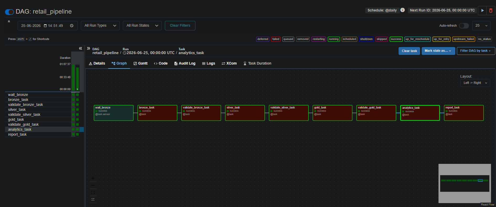
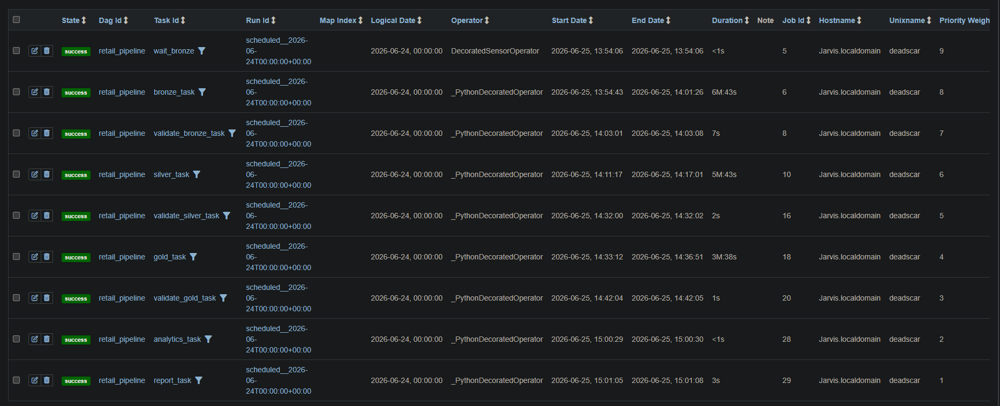
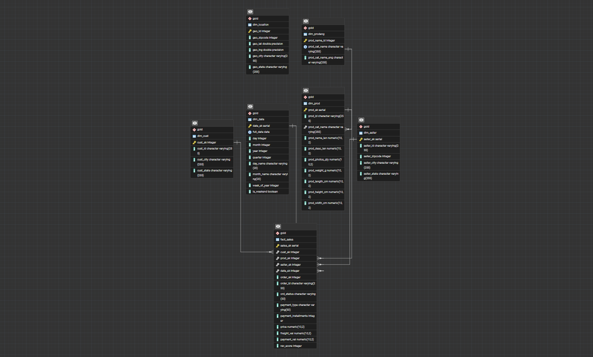
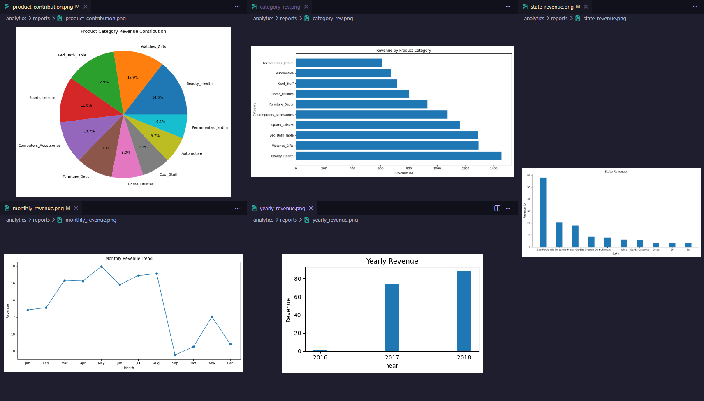

# 🛒 Retail Data Engineering Pipeline

An end-to-end Data Engineering project that automates retail data ingestion, transformation, warehousing, analytics, and reporting using **Python, PostgreSQL, PySpark, Pandas, Numpy, and Apache Airflow**.

---

## 🚀 Project Overview

This project follows the **Medallion Architecture**:

```text
Raw Data
   ↓
🥉 Bronze
   ↓
🥈 Silver
   ↓
🥇 Gold
   ↓
📊 Analytics
   ↓
📈 Reports
```

The entire workflow is orchestrated using **Apache Airflow**, enabling automated and scheduled execution of the pipeline.

---

## ⚙️ Airflow DAG Flow

```text
Wait for Raw Files
        ↓
Bronze Load
        ↓
Bronze Validation
        ↓
Silver Load
        ↓
Silver Validation
        ↓
Gold Load
        ↓
Gold Validation
        ↓
Analytics Generation
        ↓
Report Generation
```

Features implemented:

* ⏰ Scheduled execution
* 🔄 Task dependencies
* 🔁 Retry mechanism
* 📋 Task monitoring
* 📑 Execution logs
* 🚦 Data quality checkpoints

---

## 🛠️ Tech Stack

| Category        | Tools                  |
| --------------- | ---------------------- |
| Language        | Python                 |
| Database        | PostgreSQL             |
| Data Processing | Pandas, NumPy, PySpark |
| Orchestration   | Apache Airflow         |
| Visualization   | Matplotlib             |
| Environment     | WSL (Ubuntu)           |
| Version Control | Git & GitHub           |

---

## 📊 Analytics Generated

* 👥 Top Customers
* 🔁 Repeat Customers
* 💰 Revenue Per Customer
* 📅 Monthly Revenue
* 🌎 Revenue by State
* 📦 Product Contribution Analysis

---

## 📁 Project Structure

```text
retail_management/
│
├── airflow/
│   ├── dags/
│   └── logs/
│
├── datasets/
│   ├── bronze/
│   ├── silver/
│   └── gold/
│
├── analytics/
│   ├── analysis/
│   ├── reports/
│   └── visualization/
│
├── python_scripts/
├── sql/
└── README.md
```

---

## 🖥️ Setup

```bash
git clone <repository-url>
cd retail_management

python3 -m venv venv
source venv/bin/activate

pip install -r requirements.txt

export AIRFLOW_HOME=$(pwd)/airflow
export PYTHONPATH=$(pwd)
```

Start Airflow:

```bash
airflow scheduler
```

```bash
airflow webserver --port 8080
```

Open:

```text
http://localhost:8080
```

---

## 🎯 Key Learnings

* ETL Pipeline Development
* Medallion Architecture
* Data Warehousing
* Star Schema Design
* Data Validation
* Apache Airflow DAG Development
* Workflow Orchestration
* Analytics & Reporting
* PySpark Fundamentals

---

## 📸 Screenshots

Add:

* Airflow DAG Graph

* Airflow Task Execution

* PostgreSQL Star Schema

* Sample Reports


---

## 👨‍💻 Author

**Aman Kumar**

Built as a hands-on Data Engineering project to practice modern ETL pipelines, workflow orchestration, data warehousing, analytics, and reporting.
